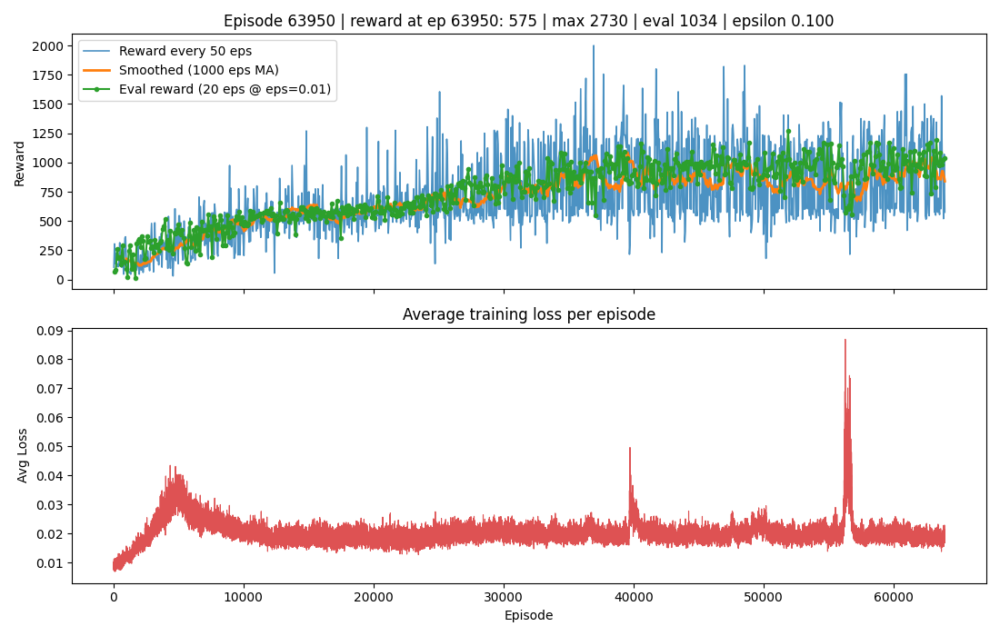
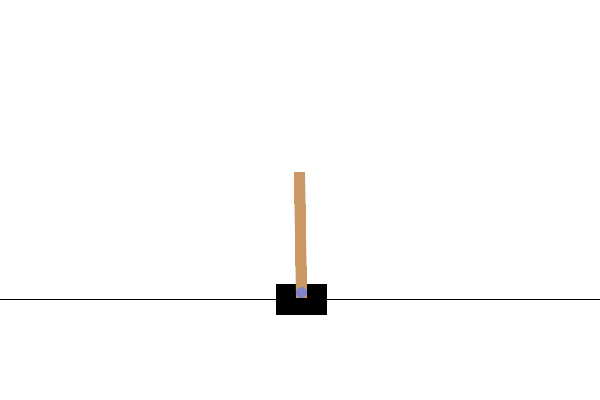

# deep-rl

Learning RL through games.

So Far I have learned
- Q-tables, 
- Deep Q Networks
- Policy Gradient Theorem
- Reinforce Algorithm

Upcoming
- Actor Critic
- PPO
- Multi-Agent Interaction

End Game
- A Starcraft Broodwar agent that can destroy me on Fastest Map Possible.

# Tutorial Projects.
## lunar-lander
- training rl with prewritten stuff doesn't feel nice. But it's nice to see what RL is capable of.

## frozen-lake
- This was supposed to be done with a q-table of state and action pairs using the bellman equation. I did do that initially and changed it up to a DQN instead. Both seem to work fine. Although i'm sure there's some bugs in my DQN training flow.

# Space Invaders

I actually decided to write this by hand because I wanted to learn DQL RL. I gotta say, not relying on AI (except for conceptual questions) really gets the knowledge the stick.
- I'm currently on Vanilla DQN. It's so bad. I can't get it to converge. (Mar 9, 2026)
- 

- Okay update, turns out my model was learning. I was just plotting the wrong metric (loss). This is useless because Q-Values are always moving targets. The ground truth is always changing. It's better to plot reward per episode (Temporal Difference in our case, i.e. one step at a time).

## Sunday, March 29, 2026.
- Okay I got it better than what is the human benchmark (reward score ~1500). Quite a few things i did here.
- I increased replay buffer significantly. Did this by storing the replay images on CPU using uint8 and then converting them to torch tensors when i sample.
- Compute loss (train) every 4th step (more for stabilizing).
- introduce double dqn (use online for getting direction (right action), target for getting magnitude (q-value))
- reduced learning rate.
- reduced rate of epsilon decay (model explores a lot more before it dies off)
- started learning session of model to initiate after 20,000 replays.
- Before this, we could only hit a max reward of 1200. That took 1 day. Now, in a couple hours, we can hit > 1500. I'm gonna let it train for a day to see what i get.

# April 1, 2026
- After training for 3 days. I managed to get an reward of ~1000. Human benchmark is 1500. I'm going to stop here as I don't think attempting to solve this will improve my RL skills. Video of the Agent will be saved in videos. Onwards to the next one! 

- Trained agent eval video: [eval-episode-0.mp4](models/space-shooter/runs/eval/eval-episode-0.mp4)

# Cartpole
## April 3, 2026    
- Started a cartpole project. Learning about policy gradients and REINFORCE algorithm.
- Gotta say, my coding is coming back, I'm mostly using llms as a lookup table at this point. Feel good to do this again.
- coded up reinforce algorithm from scratch. Trained to 50 timesteps, seems to generalize well to 100 timesteps.

- I'm sure if i train longer, it can do way better. I only trained a 2 layer network for 13 minutes.

# Next Steps
- Onwards to learning about policy gradients and PPO.
