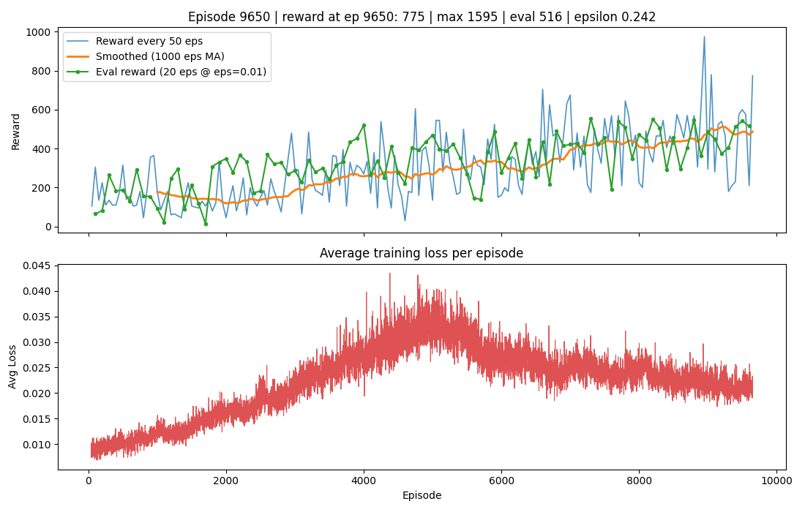

# deep-rl

Learning RL through games. 

The end game goal is to train a RL model on Starcraft Broodwar.

# Space Invaders

I actually decided to write this by hand because I wanted to learn DQL RL. I gotta say, not relying on AI (except for conceptual questions) really gets the knowledge the stick.
- I'm currently on Vanilla DQN. It's so bad. I can't get it to converge. (Mar 9, 2026)
- 

- Okay update, turns out my model was learning. I was just plotting the wrong metric (loss). This is useless because Q-Values are always moving targets. The ground truth is always changing. It's better to plot reward per episode (Temporal Difference in our case, i.e. one step at a time). Here's the reward plot below.

- Sunday, March 29, 2026. 
    - Okay I got it better than what is the human benchmark (reward score ~1500). Quite a few things i did here.
    - I increased replay buffer significantly. Did this by storing the replay images on CPU using uint8 and then converting them to torch tensors when i sample.
    - Compute loss (train) every 4th step (more for stabilizing).
    - introduce double dqn (use online for getting direction (right action), target for getting magnitude (q-value))
    - reduced learning rate.
    - reduced rate of epsilon decay (model explores a lot more before it dies off)
    - started learning session of model to initiate after 20,000 replays.
    - Before this, we could only hit a max reward of 1200. That took 1 day. Now, in a couple hours, we can hit > 1500. I'm gonna let it train for a day to see what i get. 
    
